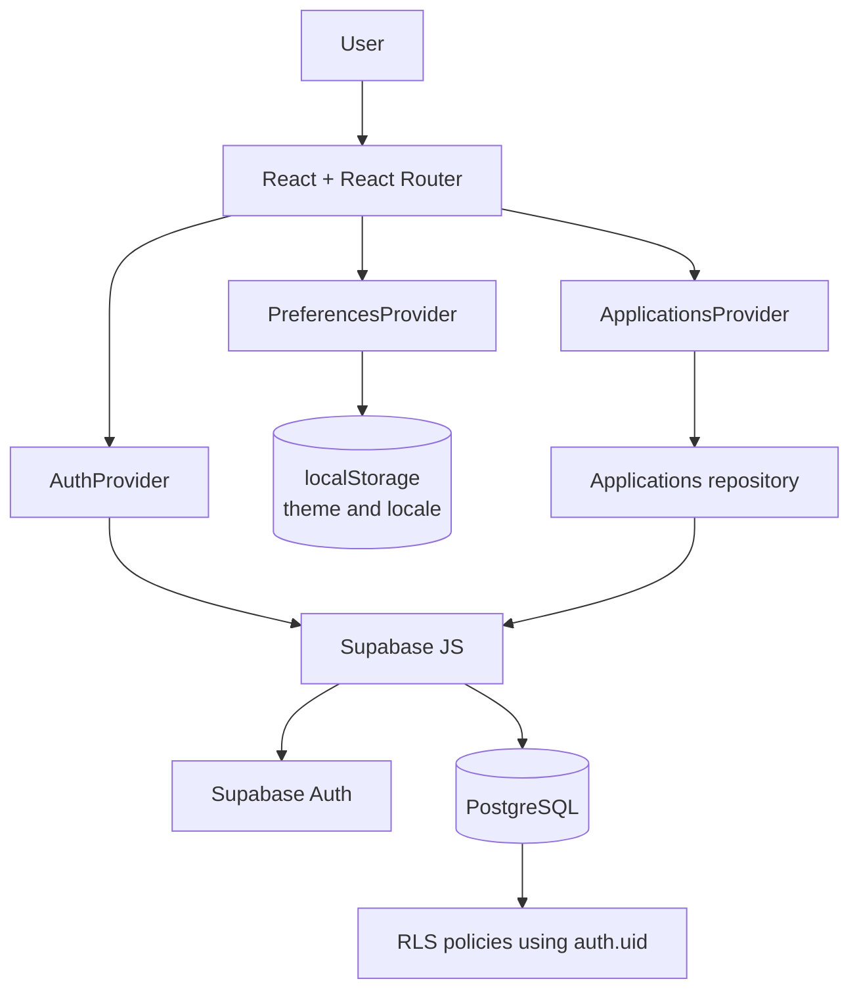

<div align="center">
  

  # ApplyFlow

  **Keep every job application in one organized flow.**

  A full-stack job application tracker built with React, TypeScript, and Supabase.

  [Live demo](https://applyflow-sable.vercel.app) · [Repository](https://github.com/maiakkkkkk/applyflow) · [Português](README.md)

  [](https://github.com/maiakkkkkk/applyflow/actions/workflows/ci.yml)
  
  
  
  
  
</div>

[Português](README.md) | **English**

## About the product

Job applications are often fragmented across LinkedIn, Gupy, company career pages, referrals, and personal notes. ApplyFlow brings those opportunities into one workspace where users can manage status, source, work mode, technologies, notes, next actions, and follow-ups.

Version 1.0 delivers an end-to-end flow: authentication, per-user persistence, List and Kanban views, dashboard metrics, scheduled follow-ups, responsive UI, PT-BR/English localization, and light/dark themes.

## Features

- **Authentication:** email/password sign-up and sign-in, Google OAuth, and protected routes.
- **Application tracking:** create, edit, and delete applications across seven pipeline states — saved, applied, test, interview, offer, rejected, and withdrawn.
- **Search and filters:** text search plus status, work mode, and source filters.
- **List and Kanban:** detailed cards or a column-based pipeline with status changes and no drag-and-drop dependency.
- **Dashboard:** total and active applications, interviews, offers, rejections, status distribution, and recently updated activity.
- **Follow-ups:** overdue, today, and upcoming groups with complete and reschedule actions.
- **Product feedback:** toasts, destructive confirmation, and loading, error, and empty states.
- **Preferences:** PT-BR default, English, light/dark theme, and persisted local choices.
- **Responsive UI:** desktop, tablet, and mobile layouts with horizontal scrolling contained inside the Kanban workspace.

## Technology stack

| Area | Technologies |
| --- | --- |
| Frontend | React 19, TypeScript, Vite, React Router |
| Backend/BaaS | Supabase JS |
| Database | PostgreSQL |
| Authentication | Supabase Auth, Google OAuth |
| Testing | Vitest, React Testing Library, user-event, jsdom |
| Quality | Oxlint, TypeScript build |
| CI/CD | GitHub Actions, Vercel |

## Architecture



Application records are persisted in PostgreSQL through Supabase. `localStorage` is used only for UI preferences: theme and locale.

### Engineering decisions

- A typed `Application` domain model keeps persisted values explicit and stable.
- `ApplicationsProvider` centralizes application state and operations, while a repository isolates Supabase access.
- PostgreSQL is the source of truth, with per-user isolation enforced in the database through RLS.
- Auth, applications, and preferences use separate providers with focused responsibilities.
- Semantic CSS tokens support visual consistency and theming without a UI framework.
- Brand assets and icons are local SVGs backed by a typed icon-name system.
- Localization uses a lightweight TypeScript dictionary; dates and currencies use native `Intl` APIs.
- `localStorage` never stores application records or credentials.

## Security

The `applications` table includes `user_id`, a foreign key to `auth.users(id)` with cascade deletion. Row Level Security is enabled, and `SELECT`, `INSERT`, `UPDATE`, and `DELETE` policies require `auth.uid() = user_id`. Anonymous table access is revoked.

`VITE_SUPABASE_PUBLISHABLE_KEY` is intentionally a client-side publishable value. Security does not depend on hiding it: authentication and RLS form the actual data-access boundary. Service-role keys, database passwords, and OAuth client secrets must never be shipped to the frontend or committed.

See [supabase/migrations/0001_create_applications.sql](supabase/migrations/0001_create_applications.sql).

## Database

Each application belongs to one authenticated user and can store company, position, status, source, job URL, location, work mode, employment type, salary range/currency, application date, next action, notes, technologies, and creation/update timestamps. `CHECK` constraints protect domain values, and indexes support per-user and recently-updated queries.

## Internationalization and theming

PT-BR is the default locale, with English available before and after authentication. Database and domain identifiers remain stable; only presentation labels are translated. Dates and monetary values use `Intl.DateTimeFormat` and `Intl.NumberFormat` for the active locale.

Theme and locale values are validated and persisted locally. The theme is applied through `data-theme` on the root element and semantic CSS custom-property overrides for surfaces, text, borders, and feedback states. The navy/Flow Blue ApplyFlow identity remains consistent in both themes without a theming dependency.

## Testing

The current suite has **10 test files and 36 passing tests**. Coverage targets authentication routes, application context and CRUD behavior, form validation, Dashboard presentation, Kanban status changes, follow-up calculations, destructive dialogs, toasts, persisted preferences, locale/theme behavior, and mobile navigation.

This is focused behavioral coverage, not a claim of complete or 100% code coverage.

```bash
npm test
```

## CI/CD

The [`.github/workflows/ci.yml`](.github/workflows/ci.yml) workflow runs for pushes and pull requests targeting `main`, using Node.js 24:

1. `npm ci`
2. `npm run lint`
3. `npm test`
4. `npm run build`

Production is hosted on [Vercel](https://applyflow-sable.vercel.app), with an SPA rewrite for client-side routes.

## Local development

### Requirements

- Node.js 24 recommended
- npm
- A Supabase project

### Setup

```bash
git clone https://github.com/maiakkkkkk/applyflow.git
cd applyflow
npm ci
cp .env.example .env.local
```

On Windows PowerShell, use `Copy-Item .env.example .env.local`.

Fill in only the project's public client values:

```env
VITE_SUPABASE_URL=
VITE_SUPABASE_PUBLISHABLE_KEY=
```

Apply [0001_create_applications.sql](supabase/migrations/0001_create_applications.sql) through the Supabase SQL editor. It creates the table, indexes, user relationship, grants, and RLS policies.

Google login requires enabling Google in Supabase Auth and configuring local and production redirect URLs. Never publish the OAuth client secret.

Start the development server:

```bash
npm run dev
```

## Scripts

| Command | Purpose |
| --- | --- |
| `npm run dev` | Start the Vite development server |
| `npm run build` | Validate TypeScript and generate the production build |
| `npm run lint` | Run Oxlint |
| `npm test` | Run the complete test suite once |
| `npm run test:watch` | Run Vitest in watch mode |
| `npm run preview` | Serve the production build locally |

## Project structure

```text
src/
├── app/                 # Routes and authenticated shell
├── components/          # Shared brand, icons, and feedback
├── features/
│   ├── applications/    # Domain, provider, repository, and workspace
│   ├── auth/            # Supabase Auth and route protection
│   ├── dashboard/       # Dashboard presentation
│   └── preferences/     # Locale, theme, and local persistence
├── i18n/                # Typed dictionaries and translation hook
├── lib/                 # Supabase client
├── pages/               # Routed pages
├── styles/              # Design tokens and global styles
└── test/                # Test setup and fixtures

supabase/
└── migrations/          # Schema, indexes, grants, and RLS

.github/
└── workflows/           # Continuous validation
```

## AI-assisted development

ApplyFlow was conceived, specified, integrated, tested, and validated by **Felipe Maia**, using OpenAI ChatGPT and Codex as AI-assisted pair-programming tools.

AI supported code generation and refactoring, implementation suggestions, debugging, review, testing, and documentation. Product and architecture decisions, scope, integrations, Git/PR workflow, validation, and implementation acceptance were conducted iteratively under the author's direction.

- **Felipe Maia** — project author, product, and development
- **OpenAI ChatGPT + Codex** — AI-assisted pair programming

## Possible future work

- Kanban drag-and-drop
- Richer analytics
- Reminder and notification integrations
- Bundle splitting and additional performance optimization

These are possible future improvements and are not part of ApplyFlow v1.0.

## Author

**Felipe Maia**<br>
[github.com/maiakkkkkk](https://github.com/maiakkkkkk)

---

**ApplyFlow v1.0** · [Live demo](https://applyflow-sable.vercel.app) · [Documentação em português](README.md)
