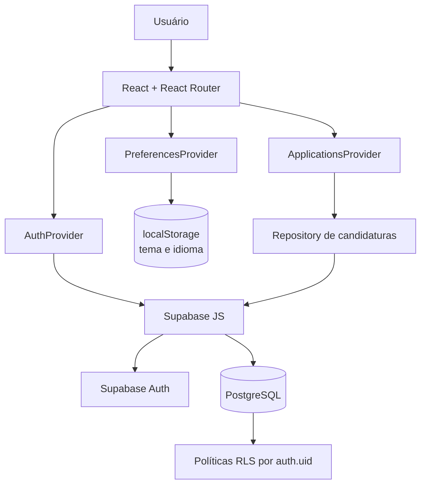

<div align="center">
  

  # ApplyFlow

  **Organize suas candidaturas em um único fluxo.**

  Um rastreador full-stack de candidaturas construído com React, TypeScript e Supabase.

  [Demo ao vivo](https://applyflow-sable.vercel.app) · [Repositório](https://github.com/maiakkkkkk/applyflow) · [English](README.en.md)

  [](https://github.com/maiakkkkkk/applyflow/actions/workflows/ci.yml)
  
  
  
  
  
</div>

**Português** | [English](README.en.md)

## Sobre o produto

Candidaturas a vagas costumam ficar espalhadas entre LinkedIn, Gupy, páginas de carreira, indicações e anotações pessoais. O ApplyFlow reúne essas oportunidades em um espaço de trabalho único para acompanhar status, origem, modelo de trabalho, tecnologias, observações, próximas ações e follow-ups.

O v1.0 entrega um fluxo completo: autenticação, persistência por usuário, visualizações em lista e Kanban, indicadores, acompanhamento de prazos, interface responsiva, localização PT-BR/EN e temas claro/escuro.

## Funcionalidades

- **Autenticação:** cadastro e login por e-mail/senha, Google OAuth e rotas protegidas.
- **Gestão de candidaturas:** criação, edição e exclusão com sete etapas — salva, candidatado, teste, entrevista, proposta, rejeitada e desistência.
- **Busca e filtros:** pesquisa textual e filtros por status, modelo de trabalho e origem.
- **Lista e Kanban:** cartões detalhados ou pipeline em colunas, com mudança de status sem drag-and-drop.
- **Dashboard:** totais, candidaturas ativas, entrevistas, propostas, rejeições, distribuição por status e atividade recente.
- **Acompanhamentos:** grupos de atrasados, hoje e próximos, com conclusão e reagendamento.
- **Feedback de produto:** toasts, confirmação destrutiva e estados de carregamento, erro e vazio.
- **Preferências:** PT-BR padrão, inglês, tema claro/escuro e escolhas persistidas localmente.
- **Responsividade:** layouts para desktop, tablet e celular; o Kanban mantém rolagem horizontal contida.

## Stack técnica

| Área | Tecnologias |
| --- | --- |
| Frontend | React 19, TypeScript, Vite, React Router |
| Backend/BaaS | Supabase JS |
| Banco de dados | PostgreSQL |
| Autenticação | Supabase Auth, Google OAuth |
| Testes | Vitest, React Testing Library, user-event, jsdom |
| Qualidade | Oxlint, build TypeScript |
| CI/CD | GitHub Actions, Vercel |

## Arquitetura



Os registros de candidaturas são persistidos no PostgreSQL por meio do Supabase. O `localStorage` armazena somente preferências de interface — tema e idioma.

### Decisões de engenharia

- O modelo de domínio `Application` é tipado e mantém valores persistidos estáveis.
- O `ApplicationsProvider` centraliza estado e operações; um repository separa o domínio da API do Supabase.
- PostgreSQL é a fonte de verdade, com isolamento por usuário aplicado no banco via RLS.
- Auth, candidaturas e preferências têm providers separados e responsabilidades explícitas.
- Tokens CSS semânticos sustentam temas e consistência visual sem framework de UI.
- Marca e ícones usam SVGs locais e um sistema de ícones com nomes tipados.
- A localização usa um dicionário TypeScript leve; datas e valores monetários usam APIs `Intl` nativas.
- O `localStorage` não guarda dados de candidatura nem credenciais.

## Segurança

A tabela `applications` inclui `user_id`, uma chave estrangeira para `auth.users(id)` com exclusão em cascata. Row Level Security está habilitado, e as políticas de `SELECT`, `INSERT`, `UPDATE` e `DELETE` exigem que `auth.uid() = user_id`. O acesso anônimo à tabela é revogado.

`VITE_SUPABASE_PUBLISHABLE_KEY` é uma chave publicável destinada ao cliente. A segurança não depende de escondê-la: o limite real de acesso aos dados são autenticação e RLS. Chaves `service_role`, senhas do banco e segredos OAuth nunca devem ser enviados ao frontend ou versionados.

Veja a definição em [supabase/migrations/0001_create_applications.sql](supabase/migrations/0001_create_applications.sql).

## Banco de dados

Cada candidatura pertence a um usuário e pode armazenar empresa, cargo, status, origem, URL da vaga, localização, modelo e tipo de trabalho, faixa salarial/moeda, data de candidatura, próxima ação, observações, tecnologias e timestamps de criação/atualização. Restrições `CHECK` mantêm os valores de domínio válidos, e índices atendem consultas por usuário e atualização recente.

## Internacionalização e temas

PT-BR é o idioma padrão e inglês pode ser selecionado antes ou depois do login. Identificadores de domínio e banco não são traduzidos; somente os rótulos de apresentação mudam. Datas e moedas são renderizadas com `Intl.DateTimeFormat` e `Intl.NumberFormat` conforme o idioma ativo.

Tema e idioma são validados e persistidos localmente. O tema usa `data-theme` no elemento raiz e sobrescreve tokens CSS semânticos para superfícies, textos, bordas e estados. A identidade navy/Flow Blue permanece consistente nos temas claro e escuro, sem dependência externa de theming.

## Testes

A suíte atual possui **10 arquivos e 36 testes passando**. Ela cobre rotas de autenticação, contexto e CRUD de candidaturas, formulário e validações, Dashboard, mudança de status no Kanban, cálculos de follow-up, confirmação destrutiva, toasts, preferências persistidas, idioma/tema e navegação móvel.

Isso representa cobertura direcionada aos principais comportamentos; não é uma declaração de cobertura total do código.

```bash
npm test
```

## CI/CD

O workflow [`.github/workflows/ci.yml`](.github/workflows/ci.yml) executa em pushes e pull requests para `main`, usando Node.js 24:

1. `npm ci`
2. `npm run lint`
3. `npm test`
4. `npm run build`

A aplicação de produção é hospedada na [Vercel](https://applyflow-sable.vercel.app), com rewrite para suportar as rotas da SPA.

## Desenvolvimento local

### Pré-requisitos

- Node.js 24 recomendado
- npm
- Um projeto Supabase

### Instalação

```bash
git clone https://github.com/maiakkkkkk/applyflow.git
cd applyflow
npm ci
cp .env.example .env.local
```

No Windows PowerShell, use `Copy-Item .env.example .env.local`.

Preencha somente os valores públicos do projeto:

```env
VITE_SUPABASE_URL=
VITE_SUPABASE_PUBLISHABLE_KEY=
```

No painel SQL do seu projeto Supabase, aplique a migration [0001_create_applications.sql](supabase/migrations/0001_create_applications.sql). Ela cria a tabela, índices, relacionamento com usuários, permissões e políticas RLS.

Para login com Google, habilite o provedor Google no Supabase Auth e configure as URLs de redirecionamento do ambiente local e de produção. Não publique o client secret OAuth.

Inicie o projeto:

```bash
npm run dev
```

## Scripts

| Comando | Finalidade |
| --- | --- |
| `npm run dev` | Inicia o servidor Vite de desenvolvimento |
| `npm run build` | Valida TypeScript e gera o build de produção |
| `npm run lint` | Executa o Oxlint |
| `npm test` | Executa todos os testes uma vez |
| `npm run test:watch` | Executa Vitest em modo watch |
| `npm run preview` | Serve localmente o build de produção |

## Estrutura do projeto

```text
src/
├── app/                 # Rotas e shell autenticado
├── components/          # Marca, ícones e feedback compartilhado
├── features/
│   ├── applications/    # Domínio, provider, repository e workspace
│   ├── auth/            # Supabase Auth e proteção de rotas
│   ├── dashboard/       # Apresentação dos indicadores
│   └── preferences/     # Idioma, tema e persistência local
├── i18n/                # Dicionários tipados e hook de tradução
├── lib/                 # Cliente Supabase
├── pages/               # Páginas roteadas
├── styles/              # Tokens e estilos globais
└── test/                # Setup e fixtures

supabase/
└── migrations/          # Schema, índices, grants e RLS

.github/
└── workflows/           # Validação contínua
```

## Desenvolvimento assistido por IA

O ApplyFlow foi idealizado, especificado, integrado, testado e validado por **Felipe Maia**, com OpenAI ChatGPT e Codex como ferramentas de pair programming assistido por IA.

A IA apoiou geração e refatoração de código, sugestões de implementação, debugging, revisão, testes e documentação. As decisões de produto e arquitetura, definição de escopo, integrações, fluxo Git/PR, validação e aceite das implementações foram conduzidas iterativamente sob direção do autor.

- **Felipe Maia** — autor do projeto, produto e desenvolvimento
- **OpenAI ChatGPT + Codex** — pair programming assistido por IA

## Possíveis evoluções

- Drag-and-drop no Kanban
- Analytics mais detalhados
- Integrações de lembretes e notificações
- Divisão de bundles e otimizações adicionais de performance

Esses itens são possibilidades futuras e não fazem parte do ApplyFlow v1.0.

## Autor

**Felipe Maia**<br>
[github.com/maiakkkkkk](https://github.com/maiakkkkkk)

---

**ApplyFlow v1.0** · [Demo](https://applyflow-sable.vercel.app) · [English documentation](README.en.md)
